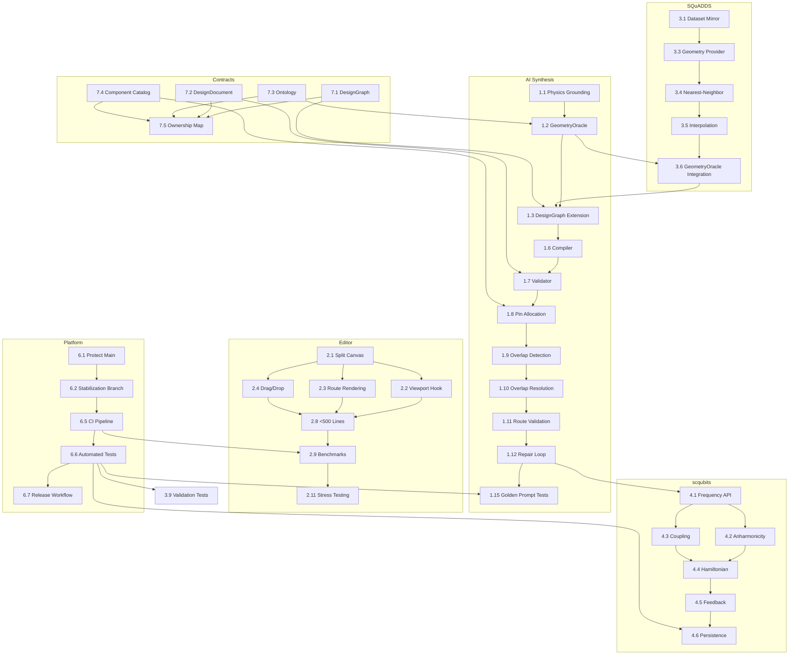

# Silicofeller Platform: Stabilization & AI Synthesis Roadmap

**Project:** Silicofeller Quantum CAD Platform Stabilization  
**Team Size:** 25 engineers across 5 teams  
**Project URL:** `github.com/silicofeller/quantum-cad/projects/1`

---

## Table of Contents

1. [Project Columns](#project-columns)
2. [Labels](#labels)
3. [Team Ownership](#team-ownership)
4. [Epics](#epics)
5. [Tasks with Dependencies](#tasks-with-dependencies)
6. [Milestones](#milestones)
7. [Issue Templates](#issue-templates)
8. [Branch Naming Conventions](#branch-naming-conventions)
9. [PR Template](#pr-template)
10. [Dependency Graph](#dependency-graph)

---

## Project Columns

| Column | Purpose |
|--------|---------|
| **Backlog** | All unscheduled work, groomed and ready for prioritization |
| **Ready** | Tasks with clear acceptance criteria, no blockers, assigned owner |
| **In Progress** | Active development (limit: 2 per engineer) |
| **Review** | PR open, awaiting code review (limit: 3 per team) |
| **Blocked** | External dependency or blocker documented (limit: 5 per team) |
| **Testing** | Merged to `stabilization`, undergoing QA/integration tests |
| **Done** | Released to `main`, verified in production/staging |

---

## Labels

### Priority Labels
- `priority/P0` — Release blocker, must complete immediately
- `priority/P1` — High impact, schedule for current sprint
- `priority/P2` — Important, schedule for next sprint
- `priority/P3` — Nice to have, backlog

### Epic Labels
- `epic/ai-synthesis`
- `epic/editor-stabilization`
- `epic/squadds-integration`
- `epic/scqubits-integration`
- `epic/palace-verification`
- `epic/platform-infrastructure`
- `epic/repository-stabilization`

### Team Labels
- `team/ai-synthesis`
- `team/editor`
- `team/physics`
- `team/platform`
- `team/architecture`

### Type Labels
- `type/epic`
- `type/task`
- `type/bug`
- `type/spike`
- `type/tech-debt`

### Status Labels
- `status/blocked`
- `status/needs-review`
- `status/ready-for-test`
- `status/in-progress`

### Component Labels
- `component/design-graph`
- `component/design-document`
- `component/ontology`
- `component/compiler`
- `component/editor-canvas`
- `component/physics-grounding`
- `component/ci-cd`
- `component/api`

---

## Team Ownership

| Team | Size | Owns | Lead |
|------|------|------|------|
| **AI Synthesis Team** | 5 | `backend/app/services/design_synth`, `backend/app/services/physics_grounding` | TBD |
| **Editor Team** | 6 | `frontend/src/lib/editor`, `frontend/src/routes/_app/schematic-editor` | TBD |
| **Physics Team** | 5 | `physics_analysis/`, `backend/app/services/physics/` | TBD |
| **Platform Team** | 4 | `deployment/`, `docker/`, `.github/workflows/`, CI/CD | TBD |
| **Architecture Team** | 5 | `DesignGraph`, `DesignDocument`, `Ontology`, `Component Catalog` contracts | TBD |

**Contract Rules:**
- Architecture Team owns core interface contracts (DesignGraph, DesignDocument, Ontology, Component Catalog)
- No modifications allowed without Architecture Team review
- All contract changes require written RFC

---

## Epics

### Epic 1: AI Design Synthesis — `epic/ai-synthesis`
**Goal:** Prompt → DesignIntent → Physics Grounding → DesignGraph → Compiler → DesignDocument → Editor (no manual fixes)  
**Owner Team:** AI Synthesis Team  
**Priority:** `priority/P0`  
**Success Criteria:**  
> Prompt: "Generate a 5-qubit heavy-hex design" → valid DesignDocument automatically.

---

### Epic 2: Schematic Editor Stabilization — `epic/editor-stabilization`
**Goal:** Professional CAD editor experience  
**Owner Team:** Editor Team  
**Priority:** `priority/P1`  
**Success Criteria:**  
> Editor remains responsive with 100+ components and 500+ routes.

---

### Epic 3: SQuADDS Integration — `epic/squadds-integration`
**Goal:** Physics-grounded design generation  
**Owner Team:** Physics Team  
**Priority:** `priority/P1`  
**Success Criteria:**  
> Generated geometries sourced from SQuADDS when available.

---

### Epic 4: scqubits Integration — `epic/scqubits-integration`
**Goal:** Fast forward physics validation  
**Owner Team:** Physics Team  
**Priority:** `priority/P1`  
**Success Criteria:**  
> Every generated design can be verified through scqubits.

---

### Epic 5: AWS Palace Verification — `epic/palace-verification`
**Goal:** Ground-truth EM validation  
**Owner Team:** Physics Team  
**Priority:** `priority/P2`  
**Success Criteria:**  
> Designs can be verified asynchronously.

---

### Epic 6: Platform & Infrastructure — `epic/platform-infrastructure`
**Goal:** Prevent engineering chaos  
**Owner Team:** Platform Team  
**Priority:** `priority/P0`  
**Success Criteria:**  
> No direct commits to main.

---

### Epic 7: Repository Stabilization — `epic/repository-stabilization`
**Goal:** Maintain clean architecture  
**Owner Team:** Architecture Team  
**Priority:** `priority/P0`  
**Success Criteria:**  
> All core interfaces have owners.

---

## Tasks with Dependencies

### Epic 1: AI Design Synthesis

| # | Task | Priority | Dependencies | Status | Owner |
|---|------|----------|-------------|--------|-------|
| 1.1 | Create Physics Grounding scaffold | P0 | — | Backlog | AI Synthesis |
| 1.2 | Create GeometryOracle abstraction | P0 | 1.1 | Backlog | AI Synthesis |
| 1.3 | Extend DesignGraph with `design_options`, `geometry_source`, `physics_metadata` | P0 | 1.2 | Backlog | AI Synthesis |
| 1.4 | Create `ontology.py` | P0 | — | Backlog | AI Synthesis |
| 1.5 | Set TransmonCross as default grounded qubit | P0 | 1.4 | Backlog | AI Synthesis |
| 1.6 | Implement compiler integration | P0 | 1.3, 1.5 | Backlog | AI Synthesis |
| 1.7 | Implement DesignDocument validator | P0 | 1.6 | Backlog | AI Synthesis |
| 1.8 | Implement pin allocation service | P0 | 1.7 | Backlog | AI Synthesis |
| 1.9 | Implement overlap detection | P0 | 1.8 | Backlog | AI Synthesis |
| 1.10 | Implement overlap resolution | P0 | 1.9 | Backlog | AI Synthesis |
| 1.11 | Implement route validation | P0 | 1.10 | Backlog | AI Synthesis |
| 1.12 | Implement deterministic repair loop | P0 | 1.11 | Backlog | AI Synthesis |
| 1.13 | Add DesignGraph tests | P0 | 1.3 | Backlog | AI Synthesis |
| 1.14 | Add Compiler tests | P0 | 1.6 | Backlog | AI Synthesis |
| 1.15 | Add Golden Prompt test suite | P0 | 1.12 | Backlog | AI Synthesis |

**Critical Path:** 1.1 → 1.2 → 1.3 → 1.6 → 1.7 → 1.8 → 1.9 → 1.10 → 1.11 → 1.12 → 1.15

---

### Epic 2: Schematic Editor Stabilization

| # | Task | Priority | Dependencies | Status | Owner |
|---|------|----------|-------------|--------|-------|
| 2.1 | Split `editor-canvas.tsx` into hooks | P1 | — | **In Progress** | Editor |
| 2.2 | Extract viewport state manager (`useCanvasViewport`) | P1 | 2.1 | **Done** | Editor |
| 2.3 | Extract route rendering manager (`useRouteRendering`) | P1 | 2.1 | **Done** | Editor |
| 2.4 | Extract drag/drop manager (`useDropHandling`) | P1 | 2.1 | **Done** | Editor |
| 2.5 | Extract selection manager | P1 | 2.1 | Backlog | Editor |
| 2.6 | Extract snapping manager | P1 | 2.1 | Backlog | Editor |
| 2.7 | Extract keyboard shortcut manager | P1 | 2.1 | Backlog | Editor |
| 2.8 | Reduce file size below 500 lines per module | P1 | 2.2–2.7 | Backlog | Editor |
| 2.9 | Add editor performance benchmarks | P1 | 2.8 | Backlog | Editor |
| 2.10 | Add memory leak audit | P1 | 2.8 | Backlog | Editor |
| 2.11 | Add canvas stress testing (100+ components, 500+ routes) | P1 | 2.9 | Backlog | Editor |

**Critical Path:** 2.1 → 2.2–2.7 → 2.8 → 2.9 → 2.11

---

### Epic 3: SQuADDS Integration

| # | Task | Priority | Dependencies | Status | Owner |
|---|------|----------|-------------|--------|-------|
| 3.1 | Local SQuADDS dataset mirror | P1 | — | Backlog | Physics |
| 3.2 | Dataset refresh workflow | P1 | 3.1 | Backlog | Physics |
| 3.3 | Geometry retrieval provider | P1 | 3.1 | Backlog | Physics |
| 3.4 | Nearest-neighbor retrieval | P1 | 3.3 | Backlog | Physics |
| 3.5 | Design interpolation service | P1 | 3.4 | Backlog | Physics |
| 3.6 | GeometryOracle integration | P1 | 1.2, 3.5 | Backlog | Physics |
| 3.7 | Caching layer | P1 | 3.3 | Backlog | Physics |
| 3.8 | Physics-grounding API | P1 | 3.6, 3.7 | Backlog | Physics |
| 3.9 | Validation tests | P1 | 3.8 | Backlog | Physics |

**Critical Path:** 3.1 → 3.3 → 3.4 → 3.5 → 3.6 → 3.8 → 3.9

---

### Epic 4: scqubits Integration

| # | Task | Priority | Dependencies | Status | Owner |
|---|------|----------|-------------|--------|-------|
| 4.1 | Frequency verification API | P1 | — | Backlog | Physics |
| 4.2 | Anharmonicity verification | P1 | 4.1 | Backlog | Physics |
| 4.3 | Coupling verification | P1 | 4.1 | Backlog | Physics |
| 4.4 | Hamiltonian validation | P1 | 4.2, 4.3 | Backlog | Physics |
| 4.5 | Design feedback generation | P1 | 4.4 | Backlog | Physics |
| 4.6 | Physics results persistence | P1 | 4.5 | Backlog | Physics |

**Critical Path:** 4.1 → 4.2, 4.3 → 4.4 → 4.5 → 4.6

---

### Epic 5: AWS Palace Verification

| # | Task | Priority | Dependencies | Status | Owner |
|---|------|----------|-------------|--------|-------|
| 5.1 | Palace worker service | P2 | — | Backlog | Physics |
| 5.2 | Job queue | P2 | 5.1 | Backlog | Physics |
| 5.3 | Result persistence | P2 | 5.2 | Backlog | Physics |
| 5.4 | Verification dashboard | P2 | 5.3 | Backlog | Physics |
| 5.5 | Calibration pipeline | P2 | 5.3 | Backlog | Physics |
| 5.6 | EM result ingestion | P2 | 5.3 | Backlog | Physics |
| 5.7 | Design comparison tools | P2 | 5.4, 5.6 | Backlog | Physics |

**Critical Path:** 5.1 → 5.2 → 5.3 → 5.4, 5.6 → 5.7

---

### Epic 6: Platform & Infrastructure

| # | Task | Priority | Dependencies | Status | Owner |
|---|------|----------|-------------|--------|-------|
| 6.1 | Protect `main` branch | P0 | — | Backlog | Platform |
| 6.2 | Create `stabilization` branch | P0 | 6.1 | Backlog | Platform |
| 6.3 | PR template | P0 | — | Backlog | Platform |
| 6.4 | Branch naming convention | P0 | — | Backlog | Platform |
| 6.5 | CI pipeline (GitHub Actions) | P0 | 6.2 | Backlog | Platform |
| 6.6 | Automated testing in CI | P0 | 6.5 | Backlog | Platform |
| 6.7 | Release workflow | P0 | 6.5 | Backlog | Platform |
| 6.8 | Docker cleanup | P0 | — | Backlog | Platform |
| 6.9 | Dependency audit | P0 | — | Backlog | Platform |

**Critical Path:** 6.1 → 6.2 → 6.5 → 6.6 → 6.7

---

### Epic 7: Repository Stabilization

| # | Task | Priority | Dependencies | Status | Owner |
|---|------|----------|-------------|--------|-------|
| 7.1 | Freeze DesignGraph contract | P0 | — | Backlog | Architecture |
| 7.2 | Freeze DesignDocument contract | P0 | — | Backlog | Architecture |
| 7.3 | Freeze Ontology contract | P0 | — | Backlog | Architecture |
| 7.4 | Freeze Component Catalog contract | P0 | — | Backlog | Architecture |
| 7.5 | Ownership map | P0 | 7.1–7.4 | Backlog | Architecture |
| 7.6 | Dependency map | P0 | 7.5 | Backlog | Architecture |
| 7.7 | Coupling analysis | P0 | 7.6 | Backlog | Architecture |
| 7.8 | Technical debt register | P0 | 7.7 | Backlog | Architecture |
| 7.9 | Critical files register | P0 | 7.5 | Backlog | Architecture |

**Critical Path:** 7.1–7.4 → 7.5 → 7.6 → 7.7 → 7.8

---

## Cross-Epic Dependencies



---

## Milestones

### Milestone 1: Prompt → DesignDocument
**Target:** 2 Weeks  
**Epics:** Epic 1 (partial), Epic 6 (partial), Epic 7 (partial)  
**Deliverables:**
- [ ] Physics Grounding scaffold (1.1)
- [ ] GeometryOracle abstraction (1.2)
- [ ] DesignGraph extension (1.3)
- [ ] `ontology.py` (1.4)
- [ ] Compiler integration (1.6)
- [ ] DesignDocument validator (1.7)
- [ ] Pin allocation service (1.8)
- [ ] `main` branch protection (6.1)
- [ ] `stabilization` branch (6.2)
- [ ] DesignGraph contract frozen (7.1)
- [ ] DesignDocument contract frozen (7.2)
- [ ] Golden Prompt test: "Generate a 5-qubit heavy-hex design" passes

**Success Criteria:** A single prompt generates a complete, valid DesignDocument with no manual intervention.

---

### Milestone 2: Prompt → Physics Grounded Design
**Target:** 4 Weeks  
**Epics:** Epic 1 (complete), Epic 3 (complete), Epic 4 (partial), Epic 6 (complete), Epic 7 (complete)  
**Deliverables:**
- [ ] All Epic 1 tasks complete
- [ ] SQuADDS dataset mirror (3.1)
- [ ] Geometry retrieval provider (3.3)
- [ ] Nearest-neighbor retrieval (3.4)
- [ ] Design interpolation service (3.5)
- [ ] GeometryOracle + SQuADDS integration (3.6)
- [ ] Physics-grounding API (3.8)
- [ ] SQuADDS validation tests (3.9)
- [ ] Frequency verification API (4.1)
- [ ] Anharmonicity verification (4.2)
- [ ] Coupling verification (4.3)
- [ ] CI pipeline with automated tests (6.5, 6.6)
- [ ] Release workflow (6.7)
- [ ] All contracts frozen and documented (7.1–7.9)

**Success Criteria:** Generated designs automatically source geometries from SQuADDS and pass scqubits frequency/anharmonicity checks.

---

### Milestone 3: Prompt → Verified Design
**Target:** 8 Weeks  
**Epics:** All Epics complete  
**Deliverables:**
- [ ] All Epic 1–4 tasks complete
- [ ] Editor stabilized with stress tests passing (2.11)
- [ ] Palace worker service (5.1)
- [ ] Job queue (5.2)
- [ ] Result persistence (5.3)
- [ ] Verification dashboard (5.4)
- [ ] Design comparison tools (5.7)
- [ ] Full platform infrastructure (6.1–6.9)

**Success Criteria:** End-to-end: prompt → generated design → physics grounding → scqubits validation → Palace EM verification → output to editor.

---

## Issue Templates

### 1. Feature/Task Template

```markdown
---
name: Task
about: New feature or engineering task
title: '[TASK] '
labels: ['type/task']
assignees: ''
---

## Summary
<!-- One-line summary -->

## Epic
<!-- Link to parent epic issue -->

## Acceptance Criteria
- [ ] Criterion 1
- [ ] Criterion 2
- [ ] Criterion 3

## Technical Notes
<!-- Implementation details, design decisions -->

## Dependencies
<!-- Blocked by: #issue -->
<!-- Blocks: #issue -->

## Estimation
<!-- Story points or time estimate -->

## Team
<!-- team/ai-synthesis, team/editor, team/physics, team/platform, team/architecture -->
```

### 2. Bug Template

```markdown
---
name: Bug
about: Something is broken
title: '[BUG] '
labels: ['type/bug']
assignees: ''
---

## Summary

## Steps to Reproduce
1.
2.
3.

## Expected Behavior

## Actual Behavior

## Environment
- Branch:
- Commit:
- Browser (if frontend):

## Severity
<!-- critical / major / minor / cosmetic -->

## Epic
<!-- Link to epic if known -->
```

### 3. Epic Template

```markdown
---
name: Epic
about: Large feature or initiative
title: '[EPIC] '
labels: ['type/epic']
assignees: ''
---

## Goal
<!-- What does this epic achieve? -->

## Success Criteria
<!-- How do we know it's done? -->

## Owner Team
<!-- team/... -->

## Priority
<!-- P0 / P1 / P2 / P3 -->

## Tasks
- [ ] #task-1
- [ ] #task-2
- [ ] #task-3

## Milestone
<!-- Which milestone does this belong to? -->

## Cross-Team Dependencies
<!-- Other teams this epic depends on -->
```

### 4. RFC (Request for Comments) Template

```markdown
---
name: RFC
about: Propose a design change or architecture decision
title: '[RFC] '
labels: ['type/spike']
assignees: ''
---

## Context

## Problem

## Proposed Solution

## Alternatives Considered

## Impact
<!-- Which components/epics are affected? -->

## Risks

## Timeline

## Reviewers
<!-- Architecture Team must review contract changes -->
```

---

## Branch Naming Conventions

| Pattern | Purpose | Example |
|---------|---------|---------|
| `feature/{epic-id}-{short-desc}` | New features | `feature/epic1-physics-grounding` |
| `bugfix/{issue-id}-{short-desc}` | Bug fixes | `bugfix/123-fix-route-cache` |
| `refactor/{component}-{short-desc}` | Code refactoring | `refactor/editor-canvas-hooks` |
| `spike/{topic}` | Investigation / spike | `spike/squadds-api` |
| `hotfix/{issue-id}-{short-desc}` | Production hotfixes | `hotfix/456-memory-leak` |
| `release/{version}` | Release preparation | `release/v0.5.0` |
| `epic/{epic-name}` | Epic integration branch | `epic/ai-synthesis` |

### Rules
1. All work branches from `stabilization`
2. No direct commits to `main`
3. All PRs require:
   - At least 1 approval from code owner team
   - CI checks passing
   - No merge conflicts
4. Epic branches merge to `stabilization` after all sub-tasks complete
5. `stabilization` merges to `main` only via release PR

---

## PR Template

```markdown
## Summary
<!-- What does this PR do? -->

## Related Issues
<!-- Fixes #issue, Relates to #epic -->

## Changes
<!-- Bullet list of changes -->

## Testing
<!-- How was this tested? -->

## Checklist
- [ ] Tests added or updated
- [ ] Documentation updated (if applicable)
- [ ] No breaking changes to frozen contracts
- [ ] Branch follows naming convention
- [ ] CI passes
- [ ] Reviewed by code owner

## Screenshots / Videos (if UI)
```

---

## Dependency Graph

### Immediate Blockers (Week 1)
- Epic 6.1 (Protect main) → Unblocks all other work
- Epic 7.1–7.4 (Freeze contracts) → Unblocks Epic 1, 3

### Sprint 1 (Weeks 1–2): Milestone 1 Foundation
- AI Synthesis: 1.1, 1.2, 1.3, 1.4, 1.6, 1.7, 1.8
- Platform: 6.1, 6.2, 6.3, 6.4, 6.5
- Architecture: 7.1, 7.2, 7.3, 7.4, 7.5

### Sprint 2 (Weeks 3–4): Milestone 2 Physics Integration
- AI Synthesis: 1.9–1.15
- SQuADDS: 3.1–3.9
- scqubits: 4.1–4.6
- Editor: 2.1–2.4 (in parallel)

### Sprint 3 (Weeks 5–6): Editor Stabilization + Verification
- Editor: 2.5–2.11
- Palace: 5.1–5.3
- Platform: 6.6–6.9

### Sprint 4 (Weeks 7–8): Integration & Polish
- Palace: 5.4–5.7
- Architecture: 7.6–7.9
- End-to-end testing
- Milestone 3 release

---

## Risk Register

| Risk | Likelihood | Impact | Mitigation |
|------|-----------|--------|------------|
| DesignGraph contract changes break downstream | Medium | High | Architecture Team gate, RFC process |
| SQuADDS API rate limits | Medium | Medium | Local mirror + caching layer |
| Palace EM jobs take too long | High | Medium | Async queue, progress indicators |
| Editor performance with 500+ routes | Medium | High | Incremental rendering, WebWorker |
| Team capacity conflicts on shared code | Medium | Medium | Ownership map, clear interfaces |
| scqubits integration complexity | Medium | High | Spike task, early prototype |

---

## Communication Plan

| Channel | Purpose | Audience |
|---------|---------|----------|
| `#ai-synthesis` | Daily standups, blockers | AI Synthesis Team |
| `#editor-dev` | Canvas, viewport, interactions | Editor Team |
| `#physics-grounding` | SQuADDS, scqubits, Palace | Physics Team |
| `#platform-ops` | CI/CD, infra, releases | Platform Team |
| `#architecture-review` | Contract changes, RFCs | Architecture Team |
| `#project-updates` | Weekly milestone updates | All teams |

---

*Document generated: 2026-06-15*  
*Next review: Weekly on Mondays*  
*Owner: Engineering Program Manager*
