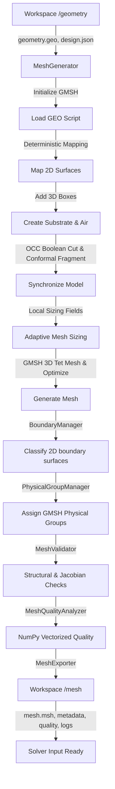

# Mesh Generator Subsystem

The `Mesh Generator` subsystem is responsible for taking the deterministic geometry script (`geometry.geo`) and archived design payload (`design.json`) produced by the **Geometry Builder**, invoking **GMSH** programmatically to generate a high-quality conformal 3D tetrahedral finite-element mesh, verifying its topological/physical integrity, calculating rigorous quality metrics, and exporting solver-ready mesh assets for the **Palace EM Solver**.

---

## Architecture & Data Flow

The subsystem is fully decoupled from both the geometric construction and the solver execution. It communicates exclusively via standardized files within the sandboxed workspace.



---

## Key Subsystem Modules

### 1. `mesh_generator.py`
The main orchestrator. Resolves sandboxed paths, loads geometry records, configures mesh sizing parameters, handles program GMSH initialization/finalization, sets up refinement fields, and runs the meshing pipeline.

### 2. `boundary_manager.py`
Extracts 2D boundary faces after conformal fragmentation and assigns them to Palace-compliant boundary conditions with strict priority and mutual exclusivity:
1.  **Ports** (`port_<qubit_id>`): Josephson junction surfaces (Attribute `100+`).
2.  **Terminals** (`terminal_<comp_id>`): Qubit islands and readout resonator traces (Attribute `10+`).
3.  **PEC** (`pec`): Ground plane and passive component traces (Attribute `3`).
4.  **Absorbing** (`absorbing`): Exterior boundaries (top, sides, bottom) of the simulation air/substrate box (Attribute `4`).

### 3. `mesh_validator.py`
Asserts mesh integrity before exporting, protecting downstream solvers from crashing:
*   **Non-Empty Check**: Verifies nodes $> 0$ and elements $> 0$.
*   **Inverted Elements**: Inspects Jacobian determinants at element integration points. If any determinant is $\le 0$, raises a `MeshValidationError`.
*   **Orphan Nodes**: Discovers nodes not referenced by any element.
*   **Element Types**: Enforces that only supported elements (lines, triangles, tetrahedra) are present.

### 4. `mesh_quality.py`
Calculates high-fidelity mesh quality metrics in parallel using highly optimized, vectorized NumPy operations.
*   **Normalized Volume-to-Edge Ratio**: Scale-invariant metric ranging from $0.0$ (flat degenerate element) to $1.0$ (perfect equilateral tetrahedron):
    $$q = 72 \sqrt{3} \frac{V}{\left(\sum_{i=1}^6 l_i^2\right)^{1.5}}$$
*   **Aspect Ratio**: Ratio of the maximum edge length to the minimum edge length:
    $$AR = \frac{\max(l)}{\min(l)}$$
*   **Quality Histogram**: Packages elements into 10 uniform quality bins.

### 5. `mesh_settings.py`
Defines configurable meshing limits, including minimum/maximum element sizes, bulk characteristic lengths, growth rates, and refinement scaling factors.

---

## Developer Usage Example

```python
from app.simulation.workspace import WorkspaceManager
from app.simulation.mesh import MeshGenerator, MeshSettings

# 1. Initialize manager and generator
workspace_manager = WorkspaceManager(root_dir="tmp/simulations")
mesh_generator = MeshGenerator(workspace_manager=workspace_manager)

# 2. Configure mesh refinement
settings = MeshSettings(
    mesh_size=0.15,            # Bulk element size (mm)
    min_element_size=0.005,    # Fine element limit near junctions (5 um)
    max_element_size=0.60,     # Coarse element limit (600 um)
    growth_rate=1.20,          # Mesh size expansion rate
)

# 3. Generate mesh for simulation
try:
    mesh_meta = mesh_generator.generate_mesh(
        simulation_id="a1b2c3d4-e5f6-7a8b-9c0d-1e2f3a4b5c6d",
        settings=settings,
        coarse=False
    )
    print(f"Mesh generated successfully with {mesh_meta.tet_count} tetrahedra!")
    print(f"Generation time: {mesh_meta.generation_time_seconds:.2f} seconds.")
except Exception as e:
    print(f"Mesh generation failed: {e}")
```
